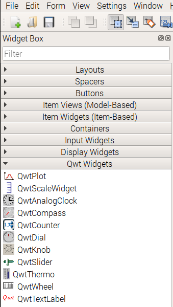
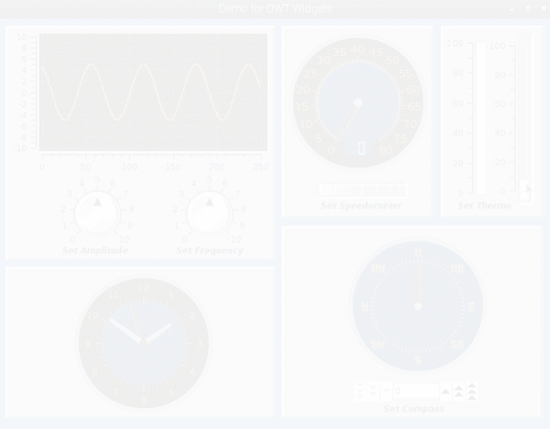

# Qwt-6-Widget-Demo
The purpose of this project was to develop a means for using the QWT-6 widgets in the QT5/Python3 environment provided on the Raspberry Pi.
## Qwt Widgets on the Raspberry Pi
 Presently the Raspberian Stretch distribution (ver. Nov-2018 as of this writing) provides a fairly up to date version of Qwt widgets (ver 6.1.2-6) for the QT5 "Designer" GUI development tool. However, a clean interface to Python3 via PyQt5 does not presently exist. Note that there is a Qwt version 5.2.3 in the distro. that works well (including dynamic loading of the .ui file) however it only supports QT4 and python2 and the widget set is not as rich as the Qwt-v6 widgets. Even more confusing is the inclusion of a version 5.2.1 Qwt5/QT4/Python2 implementation which has the plotting features but does not include the control and indicator widgets. It is desired that an end to end implementation of QT5/Qwt6 to Python3 be available for the Pi for the creation of technical applications such as data acquisition and control and to take advantage of all of the latest features.
## QT Tool Chain

 
The QT tool chain begins with the Qt "Designer" application which is used to layout the widgets and set up many, but not all, of the widget attributes. Most higher level attributes such as scale intervals and upper and lower value bounds  are available for setting in Qt Designer. Other finer and more subtle detail attributes can be set as modifications to the widgets in the Python program itself through the PyQt5 wrapper. PyQt5 is the high level Python integration to Qt. Additional integration modules can be added to the core installation of PyQt5 and the <a href="https://github.com/GauiStori/PyQt-Qwt">PyQt-Qwt Python Wrapper</a> provides full feature support for the Qwt technical widget set. Although Debian Linux is supported, difficulties were encountered in the build on the Raspbian distro version. From a non-developer point of view, the issues appeared to be largely to do with version mismatches between the component applications and also with the SIP version. SIP is the C to python bindings that connects QT to Python and anything in between. The PyQt-Qwt(Qwt6) author was gracious enough to create a backport version of the module for Raspbian Strech and was more than helpful in seeing me through the installation.

## Implementation and Demo Program
Once the installation was successful a demo program was written in Python to exercise the widgets and establish a project template for future use. First consideration of the program was the inheritance structuring. In the past my preference has been to use the <a href="http://pyqt.sourceforge.net/Docs/PyQt5/designer.html">multiple inheritance method</a> and to generate the user interface at runtime using the "loadUi" function in PyQT5. However, this method failed and in fact the command line method using pyuic5 failed as well.The uic utility is part of PYQT5 which is maintained by Qt creating another wrinkle in the tool chain to be ironed out. A clever workaround was developed by PyQt-Qwt author which enabled the command line approach to be used which results in the generation of a ui.py file that can be called in the application to generate the user interface. In the end all of the functionality of the Qwt widgets were successfully implemented to great satisfaction. Some of the major features such as the dial needles needed to be created in the program modifications rather than configured in Designer, but perhaps that is planned enhancement for the future.
## Conclusions
The Raspberry Pi is actually very capable of developing technical applications in a desktop environment. The demo program was written with PyCharm (with debug) and QT5 designer open concurrently with no noticeable difference in performance than development on a PC which would then require the added hassle of loading to the pi  target. In fact, as an engineer who has a fair amount of experience with LabVIEW, I am able to do most of what I do on a PC running LabView with the QT/Python3 set-up on the Raspberry Pi.

It would be of great benefit to pi technical maker community to have an updated integration of the QT5/Qwt6/Python3 development environment available through the Rasperian distro. Based on the challenges observed this appears to be a ways off and will require coordination of several developers, Qt, and the Raspberry Pi Foundation. 
   

